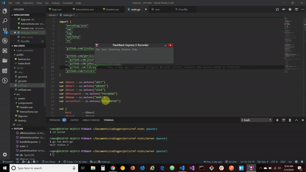

# RefStats

I wanted to learn a bit more about your technology stack so I built this over the weekend.

This is a small version of a project I've seen that I wanted to try and make myself, but hadn't touched yet. This is a reference stats counter for use on library reference desks; these kind of stats are important to track for internal use and to report to the state of Michigan. A built-out version would include data visualization rather than an itemized list and a way to edit errant data in the browser. A really built out version would include an admin view to see long-term aggregated data.

This is built with a Go backend/API, a Vue frontend, and a Postgres database. I tried to get this app running on Google App Engine and Heroku, but couldn't figure out how to correctly compile the Go backend on those services in time to share, so I've included this gif below to show that it is at least working on my machine :)

